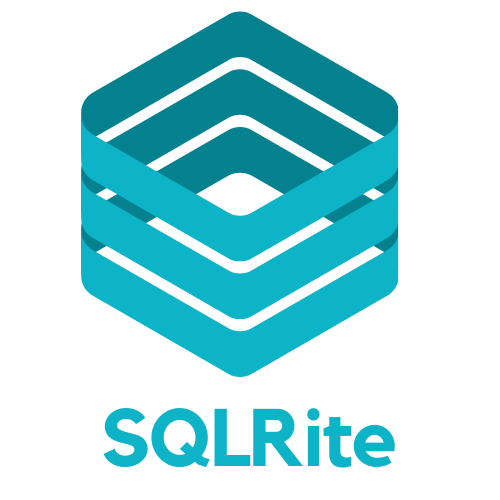

SQLRite - Design Discussions
===
This repo was created to coordinate our shared efforts, maintain interesting discussions towards the development of `SQLRite`

`SQLRite` , is a simple embedded database developed with `Rust`. The goal is to go where no man has gone before.
 Source repo: https://github.com/joaoh82/rust_sqlite

> What I cannot create, I do not understand. 
> — Richard Feynman

<table style="width:100%">
<tr>
  <td>
    <table style="width:100%">
      <tr>
        <td> key </td>
        <td> value </td>
      </tr>
      <tr>
        <td><a href="https://github.com/sponsors/sqlrite">Show us your support by buying us a coffee,  so we can keep building cool stuff. (coming soon)</a></td>
        <td></td>
      </tr>
      <tr>
        <td><a href="https://discord.gg/dHPmw89zAE">Come and Chat about databases with us</a></td>
        <td></td>
      </tr>
     </table>
  </td>
  <td>

   
  

  </td>
 </tr>
</table>

### Contributing
**Inputs and ideas are warmly welcome!!!**

For initial discussions, please [open a discussion](https://github.com/sqlrite/design/discussions) first and let's talk about it. We are all ears!

If you'd like to contribute to existing discustion, **don't be shy**. Just choose a topic being discussed and let it out.

For final decisions, we plan to [open an issue](https://github.com/sqlrite/design/issues/new) and generate RFC's documents and possibly Diagram which will be stored on this repo for future reference.

### Read the series of posts about it:
##### What would SQLite look like if written in Rust?
* [Part 0 - Overview](https://medium.com/the-polyglot-programmer/what-would-sqlite-would-look-like-if-written-in-rust-part-0-4fc192368984)
* [Part 1 - Understanding SQLite and Setting up CLI Application and REPL](https://medium.com/the-polyglot-programmer/what-would-sqlite-look-like-if-written-in-rust-part-1-4a84196c217d)
* [Part 2 - SQL Statement and Meta Commands Parser + Error Handling](https://medium.com/the-polyglot-programmer/what-would-sqlite-look-like-if-written-in-rust-part-2-55b30824de0c)
* [Part 3 - Understanding the B-Tree and its role on database design](https://medium.com/the-polyglot-programmer/what-would-sqlite-look-like-if-written-in-rust-part-3-edd2eefda473)

### Code of Conduct

Contribution to the project is organized under the terms of the
Contributor Covenant, the maintainers team of SQLRite, promises to
intervene to uphold that code of conduct.
